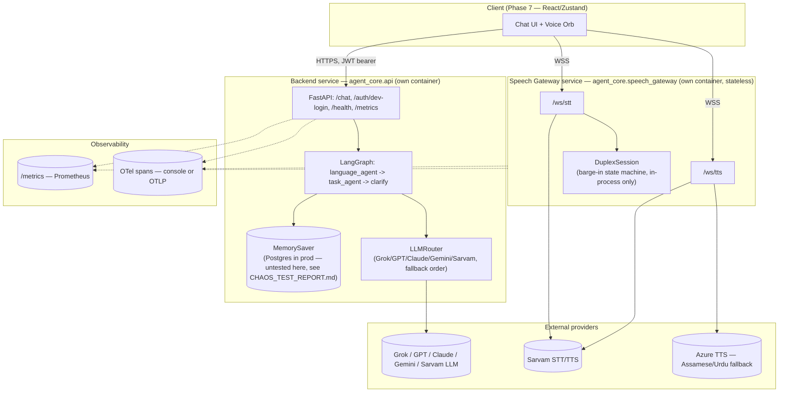
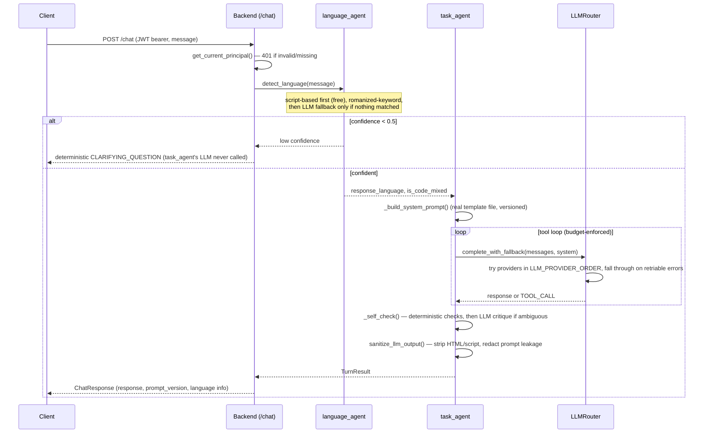
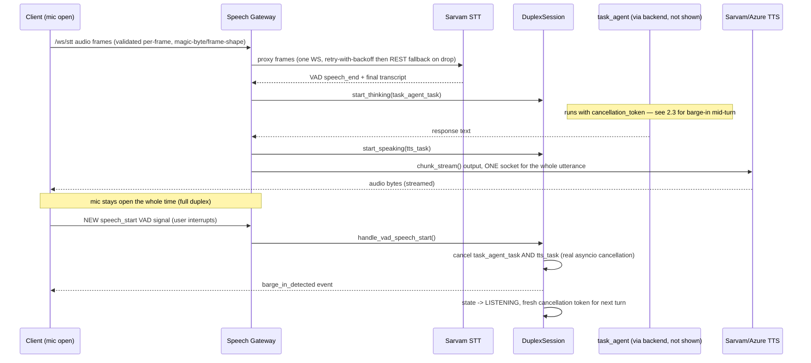

# Software Architecture Document — MAAV / Vaani

**Written against what was actually built across Phases 1-8, not the
original aspirational brief.** Every claim below points at a real file,
test, or report; where something was planned but not built, or built but not
verifiable in this environment, that's stated explicitly rather than
implied.

## 1. Component Diagram

**Key architectural fact, verified not assumed** (see
`docs/CHAOS_TEST_REPORT.md`): the Speech Gateway is genuinely stateless with
respect to conversation history. All turn/thread state lives in the
Backend's checkpointer. This was empirically confirmed by killing a real
gateway process mid-session and completing two `/chat` turns on the same
`thread_id` with zero gateway process running.

## 2. Sequence Diagrams

### 2.1 Text→Text turn (Phases 2-3, 6)

### 2.2 Speech→Speech turn with barge-in (Phases 4-5)

### 2.3 Rapid double barge-in (Phase 5 — the explicitly hard edge case)

Tested directly in `tests/test_duplex_session.py::test_rapid_double_barge_in_does_not_orphan_a_task_or_throw`:
barge-in #1 cancels turn A's tasks; a new turn B starts immediately; barge-in
#2 fires before turn B's tasks ever run to completion. Every tracked task
across both rounds ends `.cancelled()` — none left running, no exception
propagates, state lands on `LISTENING` both times.

## 3. Data / State Management

| State | Where it lives | Survives what |
|---|---|---|
| Conversation/turn history | LangGraph checkpointer (`MemorySaver` dev default; Postgres is the documented prod backend, **not exercised under chaos in this session** — see `CHAOS_TEST_REPORT.md`) | Gateway restarts (verified). Backend restarts — only if Postgres-backed; untested here. |
| Barge-in / duplex phase | `DuplexSession`, in-process, per-connection | Nothing — intentionally ephemeral, tied to one WS connection's lifetime |
| Rate-limit counters | In-memory `SlidingWindowRateLimiter`, per-process | Nothing across replicas — see `security/rate_limit.py`'s own ponytail note; Redis is the documented (not yet built) upgrade |
| JWT confirmation tokens (write-scope voice gate) | In-memory `ConfirmationGate`, per-process | Nothing across replicas — a confirmation issued by one backend replica can't be redeemed against another. **Real gap for a multi-replica deployment**, not previously called out this explicitly. |
| Raw audio | Nowhere by default (`security/retention.py` gate; `SessionState.audio_retention_consent` defaults `False`) | N/A — ephemeral by design |

## 4. Security Architecture

Full detail in `docs/THREAT_MODEL.md`; summary of what's real vs. accepted
risk:

- **Real**: JWT verification (PyJWT, real signature checks), RBAC via
  `require_role()`, the voice write-scope confirmation gate (code-level, not
  a prompt instruction), PII masking before logs, output sanitization,
  per-IP rate limiting, magic-byte audio validation, CORS allow-listing.
- **Real OAuth IdP**: Supabase (Google sign-in) issues the JWTs; the backend
  is resource-server-only (`agent_core/security/auth.py` verifies, never
  issues). Chat/audio persistence is scoped per-user via Postgres row
  ownership (`agent_core/persistence/chat_store.py`) and Supabase Storage RLS.
- **Accepted risk, explicitly not solved**: rate limiter and confirmation
  gate are both single-process (a real gap surfaced again by this SAD, see
  §3); CSRF not implemented (reasoned low-priority for bearer-token auth,
  revisit if cookies are ever added).

## 5. Observability Architecture

- **Structured logging**: `agent_core/observability/logging_config.py` — one
  JSON line per log record, correlated with the active OpenTelemetry trace
  id. `task_agent`'s existing `turn_trace` log lines (prompt version, tool
  call count, self-check result) are unchanged in content — only their
  formatting changed. Never the full prompt text, per
  `agent_system_prompt.md` §4.
- **Tracing**: real OpenTelemetry spans (`task_agent.run_turn` ->
  `llm.complete`/`llm.stream` within the backend; `stt.stream`/
  `tts.synthesize` within the gateway). `ConsoleSpanExporter` by default
  (zero collector infra needed — genuinely exercised in this session's test
  suite); OTLP exporter is a one-env-var swap for a real backend (Jaeger/
  Tempo), not yet connected to one here. **Cross-service trace propagation
  (W3C traceparent headers between gateway and backend) is not wired** —
  spans are correct *within* each service but don't yet link across the
  network boundary. Real gap, not silently assumed solved.
- **Metrics**: Prometheus (`agent_core/observability/metrics.py`) —
  histograms for STT/LLM-TTFB/LLM-latency/TTS-TTFB, counters for errors and
  reconnects by stage, a gauge for concurrent WS connections. `/metrics` on
  both services. Alert rules in `infra/observability/alerts.yml` — **written,
  syntactically real PromQL, never loaded into a live Prometheus** (none
  exists in this environment).
- **Health checks**: `/health` on both services (liveness-shaped; does not
  yet check downstream dependency health — e.g. doesn't ping Postgres/Redis
  — a reasonable next step, not done here).

## 6. Deployment Architecture

- **Backend**: blue-green (`infra/k8s/backend-deployment-green.yaml`,
  `.github/workflows/deploy.yml`). Justified by statelessness — request
  state lives in the checkpointer, not in-process, so an instant traffic
  cutover is safe. HPA scales on **CPU**, per the measured finding in
  `docs/LOAD_TEST_REPORT.md` (backend's LangGraph orchestration overhead is
  the real per-request cost, not I/O wait).
- **Speech Gateway**: canary via Argo Rollouts
  (`infra/k8s/speech-gateway-rollout.yaml`) with connection-draining —
  `terminationGracePeriodSeconds: 300`, a `preStop` sleep covering endpoint-
  propagation delay, uvicorn's own graceful shutdown, and Argo's
  `scaleDownDelaySeconds` keeping old-version pods alive to drain in-flight
  conversations rather than killing them at the traffic-shift instant. HPA
  scales on **concurrent WebSocket connections** (a custom metric,
  `maav_active_websocket_connections`), per the same load-test finding —
  this service is connection-bound, not CPU-bound, at the scale actually
  measured.
- **CI**: `.github/workflows/ci.yml` — backend tests + eval suite (always),
  a separate live-model eval job gated to `prompts/**` changes on PRs
  (requires a real provider secret, not configured in this session), Docker
  multi-stage builds for both images, frontend build. **None of this has run
  on real GitHub Actions infrastructure** — this repository was not under
  git version control before this phase (initialized here) and has no
  configured remote; the workflow YAML is syntactically real but unexecuted.

## 7. Disaster Recovery Strategy

- **Backend process/pod loss**: with `MemorySaver` (current default),
  **total loss of in-flight conversation state** — this is the single
  biggest DR gap in the system as built. Mitigation exists in code
  (`langgraph-checkpoint-postgres` is already a declared dependency) but
  requires a provisioned Postgres instance and a real `POSTGRES_DSN`, and
  was **not validated under chaos in this session** (no Docker/Postgres
  available). **This is the top DR priority before any production
  deployment**, not a nice-to-have.
- **Speech Gateway process/pod loss**: no DR concern by design — verified
  empirically (`CHAOS_TEST_REPORT.md`) that killing it loses nothing, since
  it holds no state a client needs back. The client's own reconnect logic
  (`frontend/src/api/voiceSocket.js`, exponential backoff) handles picking a
  new gateway pod.
- **Sarvam/LLM provider outage**: `LLMRouter` falls through
  `LLM_PROVIDER_ORDER` on retriable errors — multi-provider by design is
  itself a DR mechanism, not an afterthought. TTS: Sarvam failure retries
  once on a fresh socket, then falls back to a text-only signal (never dead
  air, per the failure matrix) — but there is no synthesized audio fallback
  clip actually recorded/shipped (`failure_policy.py`'s own docstring flags
  this).
- **Cross-region**: not addressed. `infra/terraform/main.tf` provisions a
  single region (`ap-south-1`); multi-region failover is unbuilt.

## 8. Cost Optimization

Grounded in what the load test actually measured, not general advice:

- **Backend autoscaling on CPU, not a flat replica count** — the load test
  showed request cost scales with LangGraph orchestration overhead
  (pydantic validation, structured logging, tracing spans) more than with
  LLM latency itself; over-provisioning replicas for LLM-latency headroom
  alone would waste spend relative to what actually drives backend cost.
- **Speech Gateway autoscaling on connection count, not CPU** — the
  inverse finding; CPU-based scaling here would under-provision (connection
  handling saturates well before CPU does, per the same report) or
  over-provision (if sized for a CPU ceiling that's never actually the
  constraint).
- **Multi-provider LLM fallback order is also a cost lever**, not just
  reliability — `LLM_PROVIDER_ORDER` can be reordered per deployment (e.g.
  cheapest-first, only falling through to a pricier provider on failure)
  with zero code change, per Phase 1's design.
- **Rate limiting bounds worst-case Sarvam/Azure spend** per the abuse
  surface named in `THREAT_MODEL.md` — but the current per-IP,
  single-process limiter (§3 above) both under-protects (no shared state
  across replicas — an attacker distributing requests across gateway pods
  evades it) and over-restricts (shared-IP legitimate traffic). Fixing this
  (Redis-backed, per-JWT-subject keying) is a cost-control item, not just a
  security one.
- **Not measured here**: actual per-request Sarvam/LLM provider dollar
  cost — no real account, no real invoice data in this environment. Any
  cost model built from this report's numbers should treat them as relative
  (which service costs more to scale) rather than absolute ($/session).

## 9. Consolidated Known Gaps

(Repeated once, not scattered per-section, precisely so a reader doesn't
have to hunt for it.)

1. Postgres-backed checkpointer DR — undeployed, unvalidated.
2. Cross-service trace propagation — not wired.
3. Rate limiter and confirmation gate — single-process, not shared across
   replicas.
4. Real OAuth IdP — not integrated (dev-login only).
5. CI/CD — written, never run on real GitHub infrastructure (no remote
   configured).
6. Docker/Terraform — written, never built/applied (no Docker/Terraform CLI
   in this environment).
7. Sarvam's real rate ceiling — unknown, unmeasurable here, must be
   confirmed with Sarvam directly before finalizing gateway autoscaling
   targets.
8. Cross-region DR — unbuilt.

None of these are silently assumed solved anywhere else in this document —
where a component depends on one of these gaps, that section says so.
